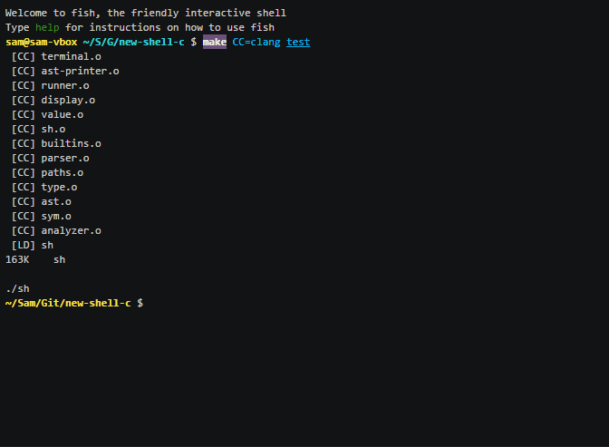

Tush [](https://travis-ci.org/Fedjmike/tush)
====

Tush is a modern, statically typed shell and scripting language. It is a major departure from classic Unix shells that were centred around string manipulation and substitution.

- **Structured**. Work with lists, tuples, functions and files, not just raw strings.
- **Functional** in syntax and type system, but imperative for working with the file system.
- **Concise but not cryptic**. No more `@du -hs "$v" >$@` or `[[ -e "$f" ]]`

[](https://asciinema.org/a/bo7yronzsxl11yrrjzppt2966)

Design
------

- An expressive type system. Parametric polymorphism, algebraic types and typeclasses. Immutable data.
- Programs are functions. Command line arguments and pipes are unified as parameters.
- Files, globs and regexes are first-class features with syntax for literals and path construction operators.
- Lists, tuples, records and dictionaries, with handling operations inspired by relational algebra.
- A new set of coreutils taking advantage of these facilities.
- A full scripting language with sane control flow, pattern matching and macros.

See the [quick start guide](/quickstart.md).

The language design has lots of open questions. Among them, how to:

- Handle errors — exceptions, Maybe monad, error codes, other possibilites?
- Dynamically type files — existential types?
- Create a language that can be seamlessly used interactively, but also for safe scripting, for programming in the large.
- Disambiguate the multiply operator (`*`) from a wildcard.

Building
--------

Dependencies: [Boehm garbage collector](https://github.com/ivmai/bdwgc/), [GNU Readline](http://cnswww.cns.cwru.edu/php/chet/readline/rltop.html), [libkiss](https://github.com/Fedjmike/libkiss)

```
sudo apt-get install libreadline-dev libgc-dev

git clone https://github.com/Fedjmike/libkiss
cd libkiss; make; cd -

git clone https://github.com/Fedjmike/tush
cd tush
make && sudo make install
```

Development
-----------

See [developing.md](/developing.md) and the [todo list](/todo.txt).

License
-------

Copyright (c) 2015 Sam Nipps.

Unless otherwise stated, a source file in this package is under the GNU GPL V3 license.

This program is free software: you can redistribute it and/or modify it under the terms of the GNU General Public License as published by the Free Software Foundation, either version 3 of the License, or (at your option) any later version.

This program is distributed in the hope that it will be useful, but WITHOUT ANY WARRANTY; without even the implied warranty of MERCHANTABILITY or FITNESS FOR A PARTICULAR PURPOSE. See the GNU General Public License for more details.

You should have received a copy of the GNU General Public License along with this program. If not, see http://www.gnu.org/licenses/.
